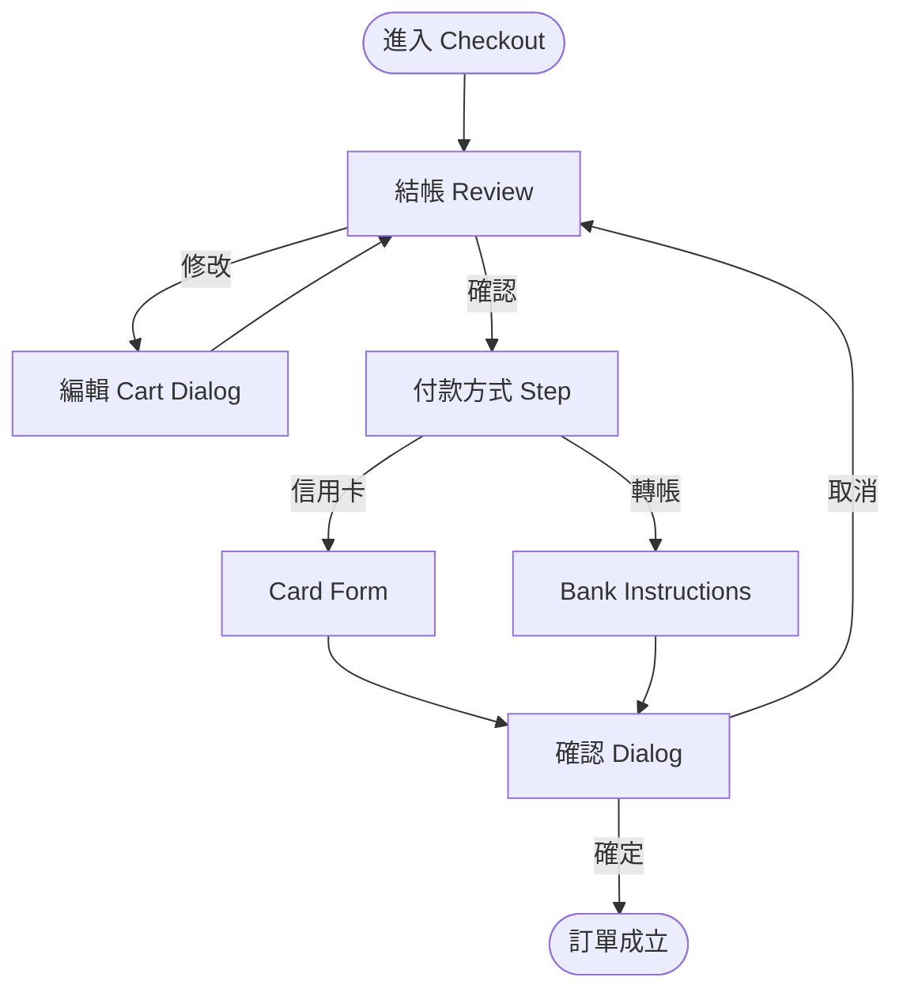

# Delivery Handoff Workflow

Purpose: 產品 / feature 通過 prototype → audit → stakeholder 決策後確認 final,需要產 **Figma-like inspectable handoff documentation** 給工程 / PM / QA / 其他 stakeholder。

本 skill **不是** prototype 階段文件(那是 `/prototype` 的 notes.md),而是**正式交付包**。

## When to run

**明確觸發**:
- User 說「要交付」「handoff」「交付文件」「給 X 團隊的文件」
- User 說「產品確認要上線了」「final 了做 handoff」「給工程交接」
- Final decision 已下 + product-ui-audit P0 都修完

**不觸發**:
- Prototype 階段(走 `/prototype`,產 exploration notes)
- Audit 階段(走 `/product-ui-audit`)
- DS 本身的 spec 維護(不走任何 skill,直接在 `.spec.md` 編)
- 要跑 audit 檢查 DS 用對不對 → `/product-ui-audit`

## 生態位

```
  /prototype           → exploration + shortlist
  /product-ui-audit    → QA gate
  [stakeholder decides final]
  [P0 fixed, P1 resolved]
  /delivery-handoff    ← 本 skill,只在 final confirmed 後
```

## Preconditions

- 產品 / feature 已 final(stakeholder 書面或對話確認)
- `/product-ui-audit` Zero P0(必要)/ P1 有計畫 resolve(建議)
- 代碼已 merge 或即將 merge 到 main branch
- 有明確 **target audience**(給工程? 給 PM? 給設計 review? 給跨團隊交接?)— AI 在 Phase 0 clarify

---

## 5-Phase Workflow

### Phase 0 — Scope & audience

**clarify with user**:
1. 交付**哪個 feature**?(single screen? full flow? 整個 module?)
2. **給誰**?
   - 工程團隊(實作參考 / QA test case)
   - PM / BA(業務理解 / 邊界 case)
   - 設計 review(世界級評估)
   - 跨團隊(onboarding 他們使用)
3. **format 需求**:
   - Storybook 原生頁(最推薦)
   - Markdown 可 export PDF
   - Mermaid diagram(UI flow)
   - Screenshot / mockup 用 Storybook render

### Phase 1 — Inventory 生成

scan 目標 feature 的 code,自動 inventory:

1. **Component 清單**(哪些 DS 元件被此 feature 消費):
   ```
   | Component | Count | Consumer files |
   |-----------|-------|----------------|
   | Button    | 12    | Checkout.tsx, Summary.tsx, ... |
   | Dialog    | 2     | Confirm.tsx, Edit.tsx |
   | Empty     | 1     | NoItems.tsx |
   ```

2. **Token 使用報告**:
   ```
   | Token | Usage | Files |
   |-------|-------|-------|
   | --primary | 8 hits | ... |
   | --fg-secondary | 14 hits | ... |
   | --error | 3 hits | ... |
   ```

3. **Layout primitives 消費**: Empty / item-layout / overlay-surface / ScrollArea / AspectRatio 各幾次。

4. **A11y checklist**(先掃再人工 review):
   - aria-label 齊全
   - role / keyboard
   - Dialog title
   - color contrast(此層 AI 報 visible,人工 review 判 final)

### Phase 2 — UI flow 圖生成

用 **Mermaid** 產 flow(Storybook 支援 render,也可 export PDF)。

範本:



AI 根據 code(route / onClick / navigation)auto-generate,user review 後微調。

### Phase 3 — Per-screen spec sheet

每個 screen / modal / flow step 一頁 spec(Storybook 的 Handoff story,或 Markdown 章節):

```markdown
## Screen: Checkout Review

**Storybook**: `Features/Checkout/Review`
**File**: `src/app/features/checkout/Review.tsx`

### 用途
使用者進入結帳後,第一屏預覽購物車 + 小計 + 折扣碼輸入。

### 主要元件
- DataTable(訂單 items)
- Input(折扣碼)
- Button(套用)
- Dialog(編輯 item 彈出)
- Empty(購物車空狀態)

### States
- **default**: 載入後正常顯示(≥1 item)
- **empty**: 購物車無 item — 顯示 Empty 元件 + 「回去繼續購物」CTA
- **error**: 折扣碼無效 — Input error state + Alert 說明

### Interactions
- 點擊 item → open Edit Dialog
- 輸入 discount → debounce 500ms → auto-validate
- 按 Apply → post /discount API

### A11y
- ✓ 所有 icon-only 有 aria-label
- ✓ Dialog 有 title + description
- ✓ keyboard 可 tab 所有互動
- ✓ color contrast 通過 WCAG AA

### 邊界 case
- 折扣碼已套用:顯示 "已套用 {code}",Apply Button 變 Clear
- 網路錯誤:顯示 Alert + retry button
- 折扣超過總額:capped 折扣 = 總額,顯示說明
```

### Phase 4 — Handoff Storybook page

在 Storybook 建立 `Features/{Feature}/Handoff` page,內含:

- **Overview**: feature 一句話重述
- **UI Flow**: Mermaid diagram(Storybook 支援 render)
- **Inventory**: 元件 / token / a11y 報告
- **Screens**: 每個 screen 可點進去的 story link + inline preview
- **Spec table**: per-screen spec 嵌入

Storybook title: `Features/{FeatureName}/Handoff`

此 page 就是「Figma-like 的 inspectable 交付」— stakeholder 打開就看到全景。

### ⚠️ Checkpoint — User review handoff package

Phase 4 產出後 pause,讓 user review:

```
📦 Handoff Package Ready

Scope: {feature}
Audience: {engineering / PM / designer / cross-team}
Package:
- Storybook page: Features/{Feature}/Handoff
- Inventory: {N components / M tokens}
- UI Flow: Mermaid diagram ({N nodes})
- Spec sheets: {N screens}
- A11y checklist: {N passed / M needs review}

Export formats:
- Storybook URL: {link}
- Markdown(可 export PDF): {path}

請 review:
(a) 通過,準備 share 給 {audience}
(b) 需要修改: ...
(c) 還缺 ... 補齊
(d) Audience 換人,調整語氣 / 深度
```

---

## 世界級 handoff 標準(reference)

本 skill 對標:
- **Figma Dev Mode** — inspectable 元件 + token + spacing
- **Zeplin** — per-screen spec + asset export
- **Shopify Polaris Pattern pages** — 完整 flow + usage + edge cases
- **Material Design Showcase** — UI + spec + code sample 三欄

我們的 Storybook handoff page 整合上述 3 個 tool 的優勢到一頁。

---

## Non-goals

- 不替代工程 code review(本 skill 是 **設計 handoff**,不是 code 品質審核)
- 不寫實作 / fix bug(已經 audit 過,final 了才 invoke 本 skill)
- 不生成業務需求文件(那是 PM 職責)
- 不管 release scheduling / branching strategy(那是 DevOps)

## Common failure modes

- **Audience 不清**: user 說「要 handoff」但沒說給誰 → Phase 0 必 clarify,否則 format 錯
- **UI flow 過度簡化**: flow 圖少 error path / loading / edge case → 讓 handoff 失真
- **Component inventory 漏掉 hidden consumption**:e.g., 內部某 function 呼叫 Toast → 需 grep 所有 imports
- **A11y checklist 自動判 pass**:checklist 只能「visible hits」,color contrast / keyboard 實測需人工
- **Spec sheet 寫成 code comment 複製**:spec 應該是 design 語言而非 code 描述,翻譯為 UX 詞彙

## References

- [references/handoff-template.md](references/handoff-template.md) — Storybook Handoff page 結構 + Markdown spec 範本
- [references/flow-diagram.md](references/flow-diagram.md) — Mermaid UI flow 指引 + 世界級 reference
- [references/inventory-checklist.md](references/inventory-checklist.md) — 元件 / token / a11y 清單 + grep pattern
