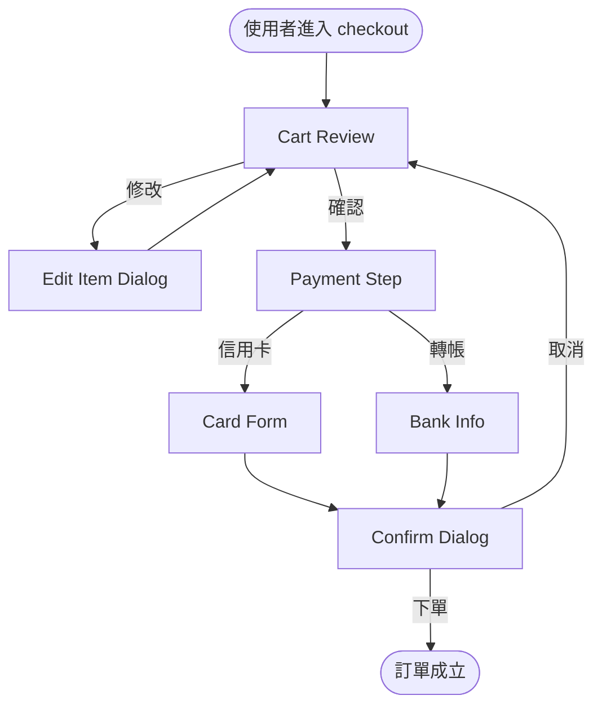
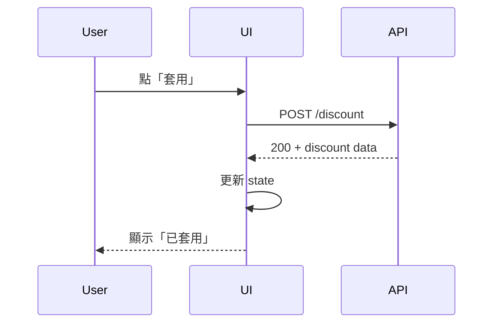
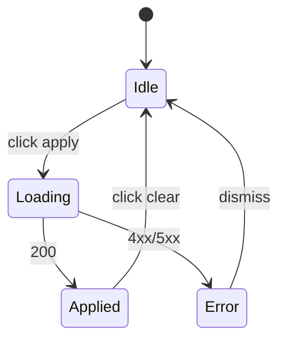
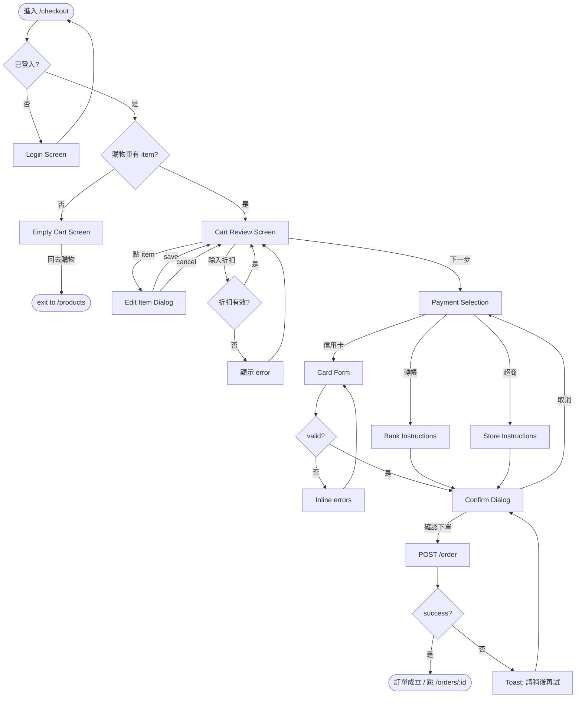
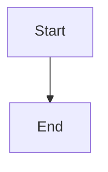

# Flow Diagram — Mermaid UI Flow 指引

---

## 為什麼用 Mermaid

- **Text-based**:可 git diff / review / version control
- **Storybook 支援**:`mdx` 可直接 render;純 `tsx` story 用 `<pre>` 包 mermaid source + 指引
- **世界級工具支援**:GitHub / Notion / GitLab / Confluence 都 render
- **Export**:可 export PNG / SVG / PDF 交付給不進 Storybook 的 stakeholder

---

## 基本語法

### flowchart(最常用)



Nodes:
- `[Text]` = rectangle(主 screen / modal)
- `([Text])` = stadium(流程起點 / 終點)
- `{Text}` = rhombus(決策點)
- `((Text))` = circle(特殊節點,如 async operation)

Edges:
- `-->` arrow
- `-->|label|` arrow with label(e.g., 條件)
- `-.->` dashed(非主路徑 / optional)
- `==>` thick(強調 / primary 路徑)

### sequenceDiagram(互動時序)



適合:非同步互動 / API 時序 / 多 actor 流程。

### stateDiagram(狀態機)



適合:元件 / feature 的狀態機(idle / loading / success / error)。

---

## 世界級 reference

對標世界級設計 handoff 的 flow 品質:

- **Shopify Polaris Pattern pages**: 每 pattern 有 `flow` section 用 SVG,我們用 Mermaid
- **Material Design Guidelines**: 流程圖 + 截圖並列
- **Stripe Documentation**: Payment Flow 用 Mermaid + inline code
- **Figma Design Process blog posts**: Journey map + flow 混合

---

## 原則

### 1. 一張圖涵蓋一個 feature,不超過 20 個 nodes

> 20+ nodes → 拆成多個 sub-flow diagram。

### 2. 標示 **error path**(非 happy path)

> 只畫 happy path = handoff 失真。user 也要知道錯誤 / 邊界 case 流向何處。

### 3. 決策點標清楚

> 用 `-->|label|` 寫條件,避免邊無敘述。

### 4. Start / End 用 stadium node

> `([Start])` / `([End])` 讓讀者知道邊界。

### 5. 搭配 spec sheet 引用

> Node text 應對應 spec sheet 的 screen / modal 名稱,讀者一眼看出對應。

---

## 範本 — Checkout 完整 flow



---

## Edge case 節點命名慣例

- `XxxError` = 錯誤狀態(顯示 Alert / Notice)
- `XxxEmpty` = 空狀態(顯示 Empty 元件)
- `XxxLoading` = 載入中
- `XxxRetry` = 可重試狀態
- `XxxSkipped` = 跳過(optional flow)

讓讀者一眼看出節點是 happy 還是 edge。

---

## 集成 Storybook

Storybook 8+ 支援 MDX,可直接寫 mermaid code block:

````mdx
# Checkout Flow


````

純 tsx story 可用 `<pre>{mermaidSource}</pre>` + 外部 render tool,或用 `mermaid.js` npm lib runtime render。

一般推薦 MDX 方式,Storybook 原生支援。
